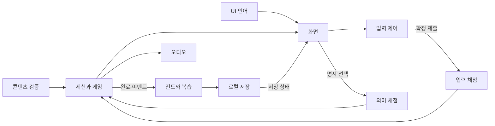

# D001 · 아키텍처 상세 설계

상태: **Draft / 로컬 구현·독립 검수 기록 연결** · 최초 작성: 2026-09-29 · 갱신: 2026-09-30

요구사항 [A001](A001-PRD.md) · UX [D002](D002-learning-game-ux.md) · 입력 [D003](D003-input-scoring.md) · 콘텐츠 [D004](D004-content-data-rights.md)

## 1. 기술 선택

React + TypeScript + Vite의 브라우저 앱을 설계 기준으로 채택한다. 화면별 상태와 번역 키를 컴포넌트로 나누고 입력·채점은 작은 제어기/순수 함수로 분리한다. 버전·설치·빌드는 MH-006에서 수행한다. React 공식 문서는 Vite를 시작 도구 중 하나로 소개한다. 이 프로젝트의 선택 근거는 여러 화면과 3언어 상태를 일관되게 관리하기 위해서다. [React 공식 문서](https://react.dev/learn/build-a-react-app-from-scratch)

정적 콘텐츠, React 내장 상태/reducer, 브라우저 저장소로 MVP를 구성한다. 단일 HTML/TypeScript도 가능하지만 화면 수가 늘 때 일관성 관리가 필요하다. 전역 상태 라이브러리·백엔드·인증·DB·실시간 서버는 도입하지 않는다. IME 선행 실험은 프레임워크 없는 로컬 페이지로 먼저 할 수 있다.

로컬 개발 서버/정적 origin에서 실행한다. `file://` 저장 동작을 전제하지 않는다. 오프라인 재실행을 보장하는 PWA·Service Worker는 후속 범위다.

## 2. 모듈과 흐름

아래 경로는 예정 모듈이며 현재 구현된 파일이 아니다.

| 모듈 | 예정 위치 | 책임 | 소유하지 않는 책임 |
|---|---|---|---|
| App/UI | src/app, src/screens | 설정·세션 → 5개 화면·포커스 | 정답 산식 |
| UI i18n | src/i18n | locale + key → 메뉴·오류·안내, 문서 lang | 문항 번역 |
| ContentRepository | src/content | 정적 데이터 검증 → 언어별 변형 | 자동 번역 |
| InputController | src/input | DOM 이벤트 + questionEpoch → 확정 스냅샷·제출 | 의미 채점·저장 |
| Scoring | src/scoring | 확정 스냅샷 + 정답 + 시계 → 분리 결과 | DOM·저장소 |
| Session/Game | src/session, src/game | 결과 + 명시 행동 → 상태·attemptId | IME 중간 값 채점 |
| Progress/Review | src/progress | 완료 결과 → 진도·오류 큐 | 원시 키 로그 |
| StorageAdapter | src/storage | 버전 있는 집계의 읽기·쓰기·이관·삭제 | 네트워크 동기화 |
| AudioAdapter | src/audio | 검수 assetId + 사용자 재생 → 상태 | 외부 TTS 자동 호출 |

`sessionId + questionEpoch + attemptId`로 문항 시도를 구별한다. 제출은 동기적으로 잠근 후 reducer로 전달한다. 저장은 완료 이벤트 단위이고 같은 attemptId는 중복 집계하지 않는다. 명시적인 다음 버튼이 새 epoch를 만든다. 이벤트 처리 세부 정본은 D003이다.

## 3. 상태·오류 경계

- 콘텐츠 실패: 3언어 오류/재시도/시작 이동. 불완전 문항을 정상 문항으로 간주하지 않는다.
- UI 언어는 세션과 분리한다. 연습 언어 전환은 미완료 취소 확인 후 새 epoch다.
- 같은 탭 중단은 마지막 확정 문자열만 메모리에 보존한다. 조합 중 문자열은 폐기 확인 후 되돌린다. 재개된 시도의 속도는 비교에서 제외한다.
- 새로고침은 저장된 완료 경계에서 이어간다. 원시 문자열을 저장하지 않아 미완료 문제는 빈 입력으로 다시 시작한다.
- 입력·의미 오답은 학습 결과, 저장·음성·콘텐츠 실패는 시스템 상태다. 시스템 실패를 오답에 더하지 않는다.
- UI 번역 누락은 개발 검사 실패다. 런타임에는 한국어 기본 문구와 누락 표시로 탈출 조작을 보장하되 릴리스 수용을 통과시키지 않는다.

## 4. 로컬 저장 계약

작은 집계만 저장하므로 `localStorage`의 단일 JSON 키 `maihangul.state`를 선택한다. 용량이 커지면 StorageAdapter 내부를 IndexedDB로 교체한다. 읽기·쓰기·삭제 예외는 잡아 UI에 결과를 전달한다. 저장 가능 여부는 실제 환경 검증 대상이다. [WHATWG Web Storage](https://html.spec.whatwg.org/multipage/webstorage.html)

| 필드 | schemaVersion 1 설계 |
|---|---|
| envelope | schemaVersion, revision(저장 충돌 확인용 증가값), savedAt, contentPackVersion, scoringVersion |
| settings | uiLocale, practiceLanguage; 복습 해석 숨김은 저장하지 않음 |
| progress | contentId + contentVersion + variantLanguage + scoringVersion + environmentGroup별 완료 수·첫 시도 요약·최근 결과. 도움/비교 자격도 별도 집계 |
| reviewQueue | contentId, contentVersion, variantLanguage, typingWrong/meaningWrong, lastAttemptId |
| resume | 마지막 완료 단계, 다음 contentId/버전; 입력 원문 없음 |
| recentAttempts | 최대 200개, 90일 보존; completedAt, attemptId, first/retry, contentId, contentVersion, variantLanguage, scoringVersion, 수치, hintExposed, assisted, interrupted, environmentGroup |

키 이벤트·입력 문자열·이름·이메일·기기 고유 ID는 저장하지 않는다. 환경은 OS 계열·브라우저 계열·PC·사용자 선택 입력 방식 범주다. 정확한 OS/브라우저 버전은 개발 검증 기록에만 남긴다. 분석 전송 SDK를 넣지 않는다.

### 읽기·이관

1. 키 없음 → 기본 상태. JSON/필드 손상 → 메모리 모드와 안내, 기존 키 덮어쓰기 금지.
2. 동일 버전 → 검증 후 90일 초과 recentAttempts 제거. 200개 초과 시 오래된 기록부터 제거. 현 콘텐츠별 집계·복습 큐는 유지.
3. 알려진 구버전 → 순차 migration을 메모리에서 실행·검증 후 쓰기. 실패하면 기존 저장값 보호와 메모리 모드.
4. 더 높은 버전 → 호환 불가 안내, 저장 비활성. 사용자가 초기화하기 전 덮어쓰지 않음.
5. 문항 버전 변경/삭제 → 과거 결과는 이력으로만 유지. 현재 숙달로 이전하지 않음. 복습은 검증된 현 버전으로 다시 연습하거나 제거 이유 표시.

schemaVersion은 저장 구조, contentVersion은 문항 의미/정답, scoringVersion은 계산 정책이다. 버전이 다른 수치를 합산 비교하지 않는다. D004의 id/revision/practiceLanguage/packVersion을 저장 시 contentId/contentVersion/variantLanguage/contentPackVersion으로 매핑한다. 개념 revision과 envelope revision은 서로 다른 값이다.

### 쓰기·충돌·실패

- 완료 결과·설정 확정 때만 저장한다. IME 이벤트마다 쓰지 않는다.
- 성공 후에만 “저장됨” 표시. quota/정책/읽기 오류는 “이 탭에서만 유지”와 학습 계속·저장 재시도 제공.
- 여러 탭의 원자적 병합은 MVP에 없다. `storage` 이벤트/revision 변경을 감지하면 현재 탭 자동 저장을 멈추고 최신 상태 읽기 또는 메모리 모드를 안내한다. 쓰기 직전 revision도 재확인한다. 경쟁 상황 무손실을 보장하지 않는다.
- 모의 실패와 실제 브라우저 저장 차단은 따로 기록한다. 브라우저·프로필·origin/포트가 바뀌면 진도가 공유되지 않는다고 안내한다.

### 초기화·삭제

“학습 기록 삭제”는 progress/reviewQueue/recentAttempts/resume만 초기화하고 언어 설정을 유지한다. “앱 데이터 모두 삭제”는 범위를 확인한 뒤 `maihangul.state` 키만 삭제한다. 다른 앱 저장값을 지우는 `localStorage.clear()`는 사용하지 않는다. 이 문서 작업에서는 실제 사용자 데이터를 삭제하지 않는다.

삭제 후 메모리 세션·예약 저장 요청도 무효화하여 옛 기록이 되살아나지 않게 한다. 삭제 실패는 완료로 표시하지 않고 재시도를 제공한다. 확인 UI에 자동 복구가 없음을 알린다.

## 5. 접근성·음성·개인정보

기본 HTML 버튼·라디오·입력 레이블을 사용한다. 색상·소리 외 텍스트 피드백, 보이는 포커스, UI와 문항별 lang을 제공한다. 조합 중 문자마다 live region을 읽지 않는다. 확대·탭 순서·스크린리더 기준은 T001이다.

음성은 자동 재생하지 않는다. 권리·검수된 로컬 파일만 클릭으로 재생한다. 부재·차단·파일 오류는 안내/수동 재시도이며 입력·점수를 막지 않는다. 외부 TTS·녹음 수집·음성 배포는 현재 전제에 없다.

저장 위치·보존·삭제·공유 PC의 진도 노출을 짧게 안내한다. 최소수집 설계이며 법적 적합성 판정이나 정책 승인으로 표현하지 않는다.

## 6. 확장과 검증

계정·클라우드는 StorageAdapter, 교육과정은 ContentRepository, 음성은 AudioAdapter 경계에서 후속 설계한다. 확장을 위해 서버나 빈 서비스를 미리 만들지 않는다. 개인정보·비용·권리·외부 공개 범위 변화 시 새 승인 범위를 확인한다.

[티켓 인덱스](tickets/INDEX.md)의 저장 손상·migration·다중 탭, 중복 방지, 실제 IME·포커스, 음성 실패 검증을 따른다. 후속 사용자 승인으로 패키지 설치·로컬 앱·자동 검사를 수행하며 실제 실행과 독립 검수 근거는 [I004](I004-harness-development.md)에 기록한다.
