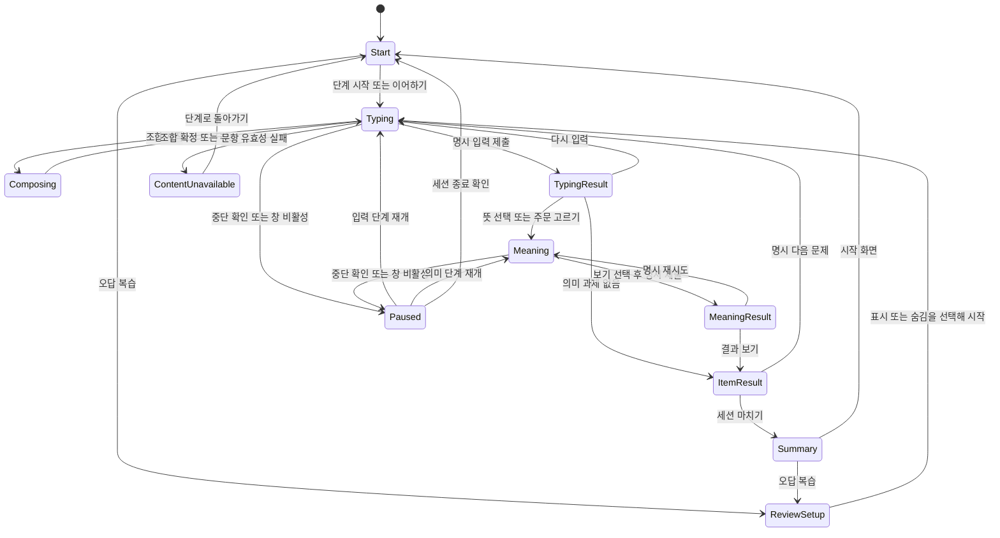

# D002 · 학습·게임 UX 상세 설계

상태: **Draft / 개발 미리보기 구현·실제 화면 검증 대기** · 기준일: 2026-09-30

현재 구현·자동 검사·독립 검수 근거는 [I004](I004-harness-development.md)를 따른다.

요구사항 정본: [A001](A001-PRD.md) · 모듈 책임: [D001](D001-architecture-overview.md) · 검증: [T001](T001-validation-plan.md) · [개발 순서](I002-development-plan.md) · [티켓](tickets/INDEX.md)

이 문서는 화면과 사용자 행동의 정본이다. 입력 이벤트·채점 산식은 [D003](D003-input-scoring.md), 콘텐츠 스키마는 [D004](D004-content-data-rights.md), 저장 구조는 D001에 두며 여기서는 화면이 요청하고 표시할 결과를 정의한다. 와이어프레임은 자체 설계안이며 실제 화면·사용성 검증 결과가 아니다.

## 1. 대상과 학습 흐름

- 검증할 대상 가정: PC를 사용하는 베트남어 모어 성인 한국어 초급자. 처음 사용하는 사람에게 자판 경험이나 한글 입력기 설치 여부를 단정하지 않는다.
- 첫 흐름: **자모·자판 → 단어 → 생활 문장 → 카페 주문 → 오답 복습**. 시작 화면에서는 추천 순서를 보여 주고 각 단계에 직접 들어갈 수도 있게 한다. 점수 때문에 다음 단계를 강제로 잠그지 않는다.
- 한국어가 기본 연습 언어다. 영어·베트남어에도 동일한 20개 개념의 자체 작성 번역 변형을 이용한 소규모 입력 연습을 제공한다. 독립적인 전체 교육과정은 후속 범위다.
- 자모·자판의 네 개 개념에도 세 언어 변형을 제공한다. 한국어에서는 자모 입력과 음절 조합을 연습하고, 영어·베트남어에서는 검수된 글자 이름이나 짧은 설명 문구를 입력한다. 화면에 각 변형의 학습 목표를 알리며 영어·베트남어 선택을 막거나 한국어로 강제 전환하지 않는다.
- 로그인 없이 시작한다. 초급 카페 게임은 제한 시간·생명·속도 벌점 없이 진행한다. 타자와 의미 선택을 다른 활동으로 보여 준다.
- 작성 예문·번역·버튼 문구는 검수 전 초안이다. 출시 대상 문항은 콘텐츠 검수 조건을 통과해야 한다.

관련 요구사항: R01, R02, R03, R06, R09, R10, R11, R19.

## 2. 공통 설정과 유지 규칙

| 설정 | 초기값·동작 | 보존·변경 경계 |
|---|---|---|
| UI 언어 | 첫 방문은 베트남어를 제안하고 시작 전 `한국어 / English / Tiếng Việt`를 선택할 수 있음 | 메뉴·오류·안내·보기 레이블·피드백·접근성 이름 변경. 진행 중 문항, 연습 언어, 확정 입력, 결과, 선택한 보기 ID 유지 |
| 연습 언어 | 한국어. 한국어·영어·베트남어를 별도 선택 | 입력 대상과 해당 언어 문항 변형 변경. 문항 진행 중에는 현재 문제를 재시작한다는 명시 확인 후 변경. 중단된 미완료 시도는 점수 분모에서 제외 |
| 해석 표시 | 문제 바로 아래 한국어 풀이·영어 해석·베트남어 해석 모두 표시 | 일반 연습과 카페에서 숨김 기능 없음. 복습 준비 화면의 기본 선택은 “해석 표시”이며, 사용자가 문항을 보기 전에 “해석 숨기고 시작”을 직접 선택한 경우에만 최초 렌더부터 숨김 |
| 오디오 | 자동 재생 끔. 사용 가능한 검수 음원만 듣기 버튼 제공 | 사용자가 누른 뒤 재생. 실패해도 텍스트 학습과 제출 가능 |
| 입력 환경 | OS·입력 방식을 사용자가 선택하거나 “알 수 없음”으로 표시 | 키보드 이벤트만으로 실제 Windows IME/Telex/VNI를 알아냈다고 표시하지 않음 |

UI 언어 변경과 연습 언어 변경은 서로 다른 컨트롤이다. “언어” 하나로 세 설정을 함께 바꾸지 않는다. 해석 세 영역은 UI 언어와 무관하게 유지하며 각 언어 영역의 언어 속성을 지정한다. 실제 OS 입력기 언어는 앱이 자동으로 바꾸지 않는다. 선택한 연습 언어와 입력 언어가 다를 때 입력기 전환 도움말을 제공한다.

### 2.1 조합 중 설정·화면 이동

조합 중에는 언어 변경·단계 이동·중단 요청을 즉시 실행하지 않는다. “입력을 확정하거나 취소한 뒤 변경할 수 있습니다”를 표시하고 원래 설정을 유지한다. 조합 종료 이벤트만으로 이동을 자동 실행하지 않으며 사용자가 변경을 다시 실행하도록 한다. UI 언어 변경도 같은 경계를 사용해 조합 중 입력란 재생성 위험을 피한다.

조합이 끝난 뒤 연습 언어 변경·문항 이탈은 확인 창을 연다. 기본 포커스는 “계속 연습”에 두고, “현재 문제 중단 후 변경”을 선택해야 미완료 시도를 종료한다. UI 언어 변경은 조합 종료 후 재실행하면 확인 창 없이 적용한다. 이벤트 순서와 포커스 이동에 따른 조합 확정 여부는 실제 입력기 선행 검증 대상이다.

### 2.2 해석·힌트와 의미 기록

- 해석은 문제와 입력란 사이에 배치한다. 화면이 좁아져도 문제 아래라는 순서를 유지한다.
- 기본 학습의 의미 선택은 해석을 본 **도움 있는 수행**으로 표시한다. 이를 독립적인 의미 회상 점수로 보고하지 않는다.
- 복습 진입 시에는 문항 내용 없는 준비 화면을 먼저 보여 준다. “해석 표시”가 기본 선택이며 과거 숨김 선택을 다음 방문에 자동 적용하지 않는다. 준비 화면·목록에는 문제 원문·해석·정답을 표시하지 않으므로 설정을 보여 준 것만으로 힌트 노출을 기록하지 않는다.
- 준비 화면에서 “해석 숨기고 시작”을 직접 선택하면 문항의 최초 렌더부터 해석을 숨긴다. 현재 문항이 이미 보인 상태의 숨김 토글은 새 attempt를 만들지 않는다.
- 해석을 숨긴 복습에서 “해석 보기”를 누르면 현재 의미 시도에 도움 사용을 기록한다. 다시 숨겨도 해당 표시를 되돌리지 않는다.
- 같은 복습 방문에서 같은 문항·개정의 해석이 한 번이라도 표시되었다면 그 뒤 즉시 재시작·재시도에도 도움 있음이 유지된다. 메모리의 `reviewVisitId`와 노출된 `contentId + contentVersion` 집합으로 연결할 수 있다. 표시 토글이나 준비 화면으로 돌아가기는 방문 종료가 아니다.
- 시작/결과 화면으로 복습을 명시 종료한 뒤 다시 복습에 들어가면 새 방문이다. 이때 시작한 무힌트 시도는 과거 학습 노출·도움 있는 결과와 별도 기록한다. 새 방문의 무힌트 표시는 그 방문의 노출 조건이며 문항을 처음 보았거나 학습 효과가 입증됐다는 뜻이 아니다.

## 3. 화면 S01 · 시작·단계 선택

### 표시와 조작

- 첫 방문: 간단한 목적, UI 언어, 연습 언어, 로컬 저장 안내, 추천 시작 단계, 입력기 도움말.
- 재방문: 마지막 완료 단계, 이어할 문항의 단계, 입력·의미별 복습 대기 수, 저장 가능 여부.
- 주 동작: “추천 단계 시작”, “이어서 연습”, “단계 선택”, “오답 복습”. 기록이 없으면 이어하기를 표시하지 않는다.
- 이어하기는 마지막 **완료 기록**을 기준으로 한다. 미완료 문항이 있으면 “마지막 문제를 처음부터 다시 시작합니다”를 알린다.
- 설정에 “학습 기록 삭제”와 “앱 데이터 모두 삭제”를 구분한다. 전자는 언어 설정을 유지하고 진도·복습·결과·이어하기를 지운다. 후자는 이 앱의 언어 설정도 지운다. 확인 창에서 삭제 대상과 자동 복구가 없음을 설명하고 “취소 / 삭제”를 분리한다. 삭제 성공 확인 후에만 해당 기록을 비우며 범위는 D001을 따른다.

```text
+------------------------------------------------------------+
| MAIHANGUL                  UI: [Tiếng Việt v] [설정]        |
| 한글을 입력하고 뜻을 연결해 보세요.                         |
| 연습 언어: [한국어 v]       [입력기·자판 도움말]            |
|                                                            |
| 추천: 1. 자모·자판         [추천 단계 시작]                 |
| 1 자모·자판 > 2 단어 > 3 생활 문장 > 4 카페 주문            |
| [이어서 연습]  [단계 선택]  [오답 복습: 입력 2 / 의미 1]    |
| 기록은 이 브라우저에 저장됩니다. 다른 기기와 공유 안 됨.    |
| 저장 상태: 사용 가능                                       |
+------------------------------------------------------------+
```

진도는 완료 문항 수와 최근 학습 단계로 표시한다. 문항을 제출하고 결과를 확인한 것은 완료 경험이며, 전체 정답·학습 숙달과 구분한다. 중단만 한 문항은 완료 수에 포함하지 않는다.

관련 요구사항: R01, R02, R06, R12, R15, R17, R19.

## 4. 화면 S02 · 자모·단어·생활 문장 연습

### 표시와 조작

- 상단: 단계, 문제 위치, 연습 언어, UI 언어, 중단 버튼. 카운트다운은 표시하지 않는다.
- 본문: 자모·자판 안내 또는 입력할 단어·문장, 아래에 세 언어 뜻, 검수된 경우 듣기.
- 입력: 명시적 레이블, 입력값, “입력 확인” 버튼. 조합 중에는 “입력 중”만 표시하며 정오 판정이나 문자별 빨간 오류를 표시하지 않는다.
- 제출은 “입력 확인” 버튼을 클릭하거나 Tab으로 버튼에 포커스를 옮긴 뒤 새 Enter/Space로 실행한다. 입력란의 Enter는 문제를 제출하지 않는다. 조합 중·조합 종료 정리 중·제출 잠금 상태에서는 버튼 동작도 접수하지 않으며, 포커스 이동으로 조합을 확정한 동작을 제출에 재사용하지 않는다.
- 입력 제출 후: 첫 시도의 타자 결과와 정오를 텍스트·기호로 표시한다. 오답은 “다시 입력 / 뜻 선택으로 계속”을 제공한다.
- 입력 정답 이후에는 “뜻 선택”을 사용자가 선택해 의미 단계로 진행한다. 자동으로 다음 화면이나 문제로 넘어가지 않는다.
- 의미 단계: 문항에 정의된 뜻·대상 보기를 선택하고 “선택 확인”으로 제출한다. 뜻 선택이 없는 자모 단계에는 의미 측정 “해당 없음”을 명시하고 결과로 이동한다.
- 결과 확인 후 “다음 문제”만 새 문항을 만든다. 제출을 연속 실행하거나 Enter를 길게 눌러도 다음 문제로 넘어가지 않는다.

```text
+------------------------------------------------------------+
| 생활 문장  2 / 5      연습: 한국어   UI: Tiếng Việt [중단]  |
| 문장을 입력해 보세요.                                      |
| 물을 주세요.                                     [듣기]   |
| 한국어 풀이: 물을 부탁할 때 쓰는 공손한 표현입니다.         |
| English: Please give me some water.                        |
| Tiếng Việt: Cho tôi xin nước.                              |
| [검수 전 예시 — 출시 문항 아님]                             |
|                                                            |
| 입력할 문장                                               |
| [______________________________________________]           |
| [입력 확인]   [자판 도움말]                                |
| 입력 결과: 제출 전                                        |
| 의미 결과: 선택 전                                        |
+------------------------------------------------------------+
```

### 재시도와 최초 기록

첫 유효 제출 결과는 고정한다. “다시 입력”은 같은 문항의 새 연습 시도를 시작하지만 최초 결과를 덮어쓰지 않는다. 입력 결과는 “첫 시도 오답 / 재시도 정답”처럼 함께 설명한다. 요약 집계에는 첫 시도만 사용한다. 오답 상태에서 뜻 선택으로 진행하면 입력 오답을 기록한 채 의미 선택을 별도로 수행한다.

붙여넣기나 중단으로 속도 측정에서 제외된 경우에는 제외 이유를 숫자 대신 표시한다. 정확도·속도의 값과 정책은 입력·채점 설계를 따른다. 입력 중인 문장을 지속 저장하지 않는다.

관련 요구사항: R01, R02, R03, R07, R08, R09, R14, R18.

## 5. 화면 S03 · 카페 주문 게임

### 독자 규칙

1. 자체 작성 주문 카드 한 장을 보여 준다.
2. 주문 문장을 입력하고 “입력 확인”으로 제출한다.
3. 입력 결과를 확인한 뒤 “주문 고르기”로 넘어간다. 오답도 재시도 또는 계속 진행할 수 있다.
4. 텍스트로 설명된 주문·사물 카드 세 개 중 하나를 고른다. 보기 원문·정답은 D004의 검수된 문항 정의를 따른다.
5. “선택 확인”으로 의미 답안을 제출한다. 정답은 이유를, 오답은 선택한 대상과 문장의 의미 차이를 설명한다.
6. “한 번 더 고르기”는 첫 의미 결과를 보존한 재시도다. “결과 보기” 후 사용자가 다음 주문을 선택한다.

초기 그래픽은 자체 텍스트·기본 도형 카드로 구성한다. 외부 캐릭터·카페 화면·이미지·음원은 요구하지 않는다. 첫 모드에는 제한 시간, 경쟁 순위, 생명 감소가 없다. 입력을 잘못했어도 게임 전체를 실패 처리하지 않는다.

```text
+------------------------------------------------------------+
| 카페 주문  1 / 4           시간제한 없음             [중단]|
| 주문: 물을 주세요.                                        |
| 한국어 풀이: ...                                          |
| English: ...                                              |
| Tiếng Việt: ...                                           |
| 입력: [물을 주세요._________________] [입력 확인]          |
| 입력 결과: 첫 시도 정답                 [주문 고르기]      |
|                                                            |
| 뜻에 맞는 주문을 선택하세요.                              |
| ( ) [ 물 한 잔 ]  ( ) [ 차 한 잔 ]  ( ) [ 빈 컵 ]          |
| [선택 확인]                                               |
| 의미 결과: 선택 전 · 해석 도움 있음                        |
+------------------------------------------------------------+
```

위 문장·풀이·보기는 검수 전 UX 예시다. 선택한 보기는 테두리뿐 아니라 선택 표시와 텍스트로 알린다. 정답을 확정하기 전에는 변경할 수 있다. 키보드 포커스만 이동한 것은 제출이 아니다.

관련 요구사항: R03, R04, R09, R10, R13, R16.

## 6. 화면 S04 · 결과

### 문항 결과와 세션 요약

| 영역 | 표시 | 피할 오해 |
|---|---|---|
| 타자 | 첫 입력 정확도, 속도 또는 제외 이유, 재시도 여부 | 의미를 이해한 정도를 타자 속도로 환산하지 않음 |
| 의미 | 첫 선택 정오, 도움 있음/없음, 재시도 정오 | 해석을 본 답변을 독립 회상으로 표시하지 않음 |
| 진도 | 완료한 문제, 건너뛴·중단한 문제 | 미완료·콘텐츠 오류 문항은 정답률 분모에서 제외 |
| 복습 | 입력 복습과 의미 복습 대상 수 | 두 유형의 오류를 하나로 합치지 않음 |
| 저장 | 저장됨 / 저장 중 / 저장 실패·세션에만 유지 | 저장 성공 확인 전에 “저장됨”을 표시하지 않음 |

```text
+------------------------------------------------------------+
| 이번 연습 결과                                            |
| 타자: 첫 시도 정확도 [계산 결과] · 속도 [값 또는 제외 이유]|
| 의미: 첫 시도 3 / 4 · 해석 도움 있음                       |
| 재시도: 입력 1문제, 의미 1문제                             |
| 복습할 문제: 입력 1 / 의미 1                               |
| 저장 상태: 저장됨                                         |
| [오답 복습]  [다음 단계]  [시작 화면]                       |
+------------------------------------------------------------+
```

세션 요약의 분모는 실제 첫 제출이 있는 유효 문항 수다. 입력과 의미의 분모가 다를 수 있으므로 각각 표시한다. 기록이 없으면 `0%` 대신 “아직 기록 없음”을 표시한다. 콘텐츠 오류는 학습자 오답으로 만들지 않는다. 속도 비교는 동일한 언어·입력 방식·기기 분류·채점 버전 안에서만 제공하며 초기 화면에 통합 순위를 만들지 않는다.

저장 실패 시 현재 세션 결과를 유지하고 “이 창에서는 결과를 볼 수 있지만 다시 열면 사라질 수 있습니다”를 표시한다. 사용자가 재시도할 수 있으며 저장 실패로 학습을 강제로 중단하지 않는다.

관련 요구사항: R09, R11, R12, R17, R18, R19.

## 7. 화면 S05 · 오답 복습

- 탭: “입력 복습 / 의미 복습 / 전체”. 한 문항이 두 유형에 해당하면 원인을 둘 다 표시하고 전체에서는 한 장으로 묶는다.
- 첫 진입은 문항 내용 없는 준비 화면이다. 오류 유형·대상 수·연습 언어와 기본 “해석 표시” 선택만 제공한다. “표시하고 시작” 또는 명시적 “해석 숨기고 시작”으로 문항을 처음 연다.
- 실행 중의 표시/숨김은 현재 시도만 갱신하고 attempt나 노출 기록을 초기화하지 않는다. 같은 방문에서 해당 문항·개정의 해석을 본 뒤 재시작해도 도움 있음으로 유지한다. 다음 문항은 그 문항의 방문 내 노출 여부를 따로 적용한다.
- 입력 복습은 원문 입력과 최초 오답 유형을 알려 주되 과거의 원시 입력문은 불러오지 않는다. 의미 복습은 원문과 검수된 보기를 제공한다.
- 과거 학습 시도의 첫 점수와 이번 복습의 첫 점수를 구분한다. 복습으로 이전 결과를 고치지 않는다.
- 입력 복습은 새 복습 시도에서 입력 정답이면 해결 처리한다. 의미 복습은 해당 방문에서 그 문항·개정의 해석 노출이 없는 숨김 시도의 첫 의미 답이 정답일 때 해결 처리한다. 도움을 요청했거나 첫 답이 틀린 경우 해당 시도에서 나중에 맞혀도 의미 복습 대상에 남기고 이유를 안내한다. 즉시 재시작으로 같은 방문의 해석 노출을 지울 수 없다.
- 복습 결과는 이 기기 안에서 해당 항목을 정리한 기록이며 장기 학습 숙달 판정이 아니다.
- 대상이 없으면 “복습할 오답이 없습니다”와 단계 선택을 표시한다. 없던 오답을 임의 생성하지 않는다.

준비 상태 — 문항·해석·정답 노출 없음:

```text
+------------------------------------------------------------+
| 오답 복습 준비    [입력] [의미] [전체]              [돌아가기]|
| 연습 언어: 한국어     대상: 의미 복습 2개                   |
| 해석 설정: (o) 표시  ( ) 숨김                              |
| [표시하고 시작]             [해석 숨기고 시작]              |
| 숨김은 이번 복습에서 직접 선택한 경우에만 적용됩니다.      |
+------------------------------------------------------------+
```

실행 상태 — 준비 화면에서 숨김을 선택한 예:

```text
+------------------------------------------------------------+
| 오답 복습  1 / 2                                    [중단]|
| 연습 언어: 한국어     원인: 의미 선택                      |
| 물을 주세요.                                              |
| 해석: 숨김                                   [해석 보기] |
| [입력란__________________________] [입력 확인]              |
| 뜻에 맞는 보기: ( ) 물  ( ) 차  ( ) 빈 컵                  |
| [선택 확인]                                               |
| 이번 방문: 해석 노출 없음  / 과거 첫 시도: 의미 오답        |
+------------------------------------------------------------+
```

표시를 선택한 실행 화면은 같은 문제 아래에 세 언어 해석을 렌더한다. 숨긴 해석은 시각적으로만 가리는 대신 접근성 트리에서도 읽히지 않게 한다. 숨김을 되돌리면 노출을 기록하고 세 언어 모두 다시 제공한다.

관련 요구사항: R03, R09, R11, R16, R19.

## 8. 상태 전이와 제출 경계

### 8.1 화면 상태



조합 중 중단·전환 요청은 상태를 바로 바꾸지 않는 보류 요청이다. 위 도식의 `Composing`은 입력 상태를 설명하며 실제 브라우저 이벤트 흐름을 보증하지 않는다. 창 비활성 중에 조합 종료 이벤트가 늦게 도착하더라도 확정 점수나 문항 전환을 만들지 않는다.

### 8.2 입력·행동·예상 결과 계약

| 입력·상태 | 사용자 행동 | 예상 결과 |
|---|---|---|
| 한글 조합 중 | Enter | 조합 확정에 사용. 입력 결과·의미 화면·다음 문항으로 이동하지 않음 |
| 조합 종료 후 입력란에 포커스 | Enter | 입력 제출 없음. 단일 행 입력의 일반 Enter 기본 동작만 방지 |
| 조합 종료 정리가 끝난 입력 가능 상태 | 입력 확인 클릭 또는 버튼 포커스 후 새 Enter/Space | 한 번의 제출만 접수하고 입력 결과를 고정 |
| 조합 중·조합 종료 정리 중 | 입력 확인 버튼 동작 또는 포커스 이동과 함께 클릭 | 제출 없음. 확정·취소 및 정리가 끝난 뒤 새로운 명시 동작으로 제출 |
| 입력 결과 고정 | 연속 Enter·더블 클릭·늦은 input 이벤트 | 점수 추가·다음 문제 이동 없음 |
| 입력 오답 | 뜻 선택으로 계속 | 첫 입력 오답 유지, 의미 답안은 별도 평가 |
| 의미 보기 선택 전 | 선택 확인 | 제출하지 않고 “보기를 선택하세요” 안내 |
| 의미 오답 | 한 번 더 고르기 | 첫 결과 보존, 명시 재시도 시작 |
| 문항 결과 | 다음 문제 클릭 | 새 `questionEpoch` 생성, 이전 문항 이벤트는 무시 |
| 입력 진행 중 | UI 언어 변경 | 현재 입력·문항·결과 유지. 조합 중이면 변경 보류 |
| 입력 진행 중 | 연습 언어 변경 확인 | 미완료 시도 종료, 새 언어 변형으로 문항 재시작 |
| 복습 준비 화면 | 해석 숨기고 시작 | 문항 최초 렌더부터 해석 숨김, 실제 노출 이력 없음 |
| 복습에서 해석 숨김 | 해석 보기 | 세 언어 해석 표시, 현재 의미 시도와 해당 방문의 문항·개정에 노출 기록 |
| 해석을 본 복습 문항 | 다시 숨김 또는 같은 방문에서 재시작 | 숨김 토글은 새 attempt를 만들지 않으며 방문 내 노출 기록·도움 있음 유지 |
| 번역 누락·문항 손상 | 문항 로딩 | 문항을 시작하지 않고 콘텐츠 문제 안내, 학습자 점수 제외 |

채점 결과를 접수한 제출은 잠근다. 다시 입력·의미 재시도는 명시 행동으로 새 시도를 생성하고, 다음 문제는 새 문항 식별 범위를 생성한다. 화면 재렌더나 조합 종료가 재시도·다음 문제의 트리거가 되어서는 안 된다.

## 9. 중단·재개와 포커스

### 9.1 같은 탭에서 중단

- 중단 버튼은 확인 창을 연다. “계속 연습”은 입력과 기존 포커스로, “잠시 중단”은 정지 화면으로 이동한다.
- 조합 중에 창 비활성이나 탭 숨김이 발생하면 평가하지 않고 중단 상태로 전환한다. 마지막 확정 문자열만 메모리에 보관한다. 복귀 시 “마지막 조합 글자는 다시 입력해야 할 수 있습니다”를 알리고 “미확정 글자를 버리고 재개”를 확인한 뒤 마지막 확정 문자열로 돌아간다.
- 같은 탭의 재개는 마지막 확정 입력값과 제출된 결과를 유지한다. 아직 제출하지 않은 입력 단계에서 끊긴 시도는 속도 집계에서 제외하고 정확도는 제출 시 평가한다.
- 이미 제출이 끝난 타자 결과는 이후 의미 단계의 중단 때문에 바꾸지 않는다. 의미 선택 중단은 답을 자동 확정하지 않는다.
- 브라우저 새로고침·닫기는 앱 확인 창이 항상 표시된다고 보장하지 않는다. 로컬에는 원시 입력을 저장하지 않으므로 다시 열면 미완료 문항을 처음부터 시작하고 기존 완료 결과만 유지한다.

### 9.2 키보드와 접근성

| 상황 | 포커스 규칙 |
|---|---|
| 화면 최초 진입 | 화면 제목에 프로그램 포커스를 두고 다음 Tab으로 주 조작에 접근. 모바일 키보드 자동 호출을 전제로 하지 않음 |
| 사용자가 연습 시작·다음 문제 선택 | 새 문항의 문제 제목과 레이블을 알린 뒤 입력란으로 이동 |
| IME 입력 중 | DOM 입력 요소를 교체하거나 포커스를 강제로 옮기지 않음 |
| 입력 결과 수신 | `aria-live`의 짧은 결과 안내. 포커스는 제출 컨트롤에 유지하며 다음 이동은 사용자 선택 |
| 보기 선택 | 라디오 그룹 사용. Tab으로 그룹 진입, 방향키로 선택, 별도 확인 버튼으로 제출 |
| 재시도 | 입력 재시도는 입력란, 의미 재시도는 보기 그룹으로 이동 |
| 확인 창 | 제목·설명 제공, 포커스가 창 내부에 유지, 기본은 취소·계속, Esc는 취소, 닫은 뒤 호출 컨트롤로 복원 |
| 언어 변경 | 변경한 언어 컨트롤의 포커스 유지. 화면 읽기 문구를 선택 UI 언어로 갱신 |
| 저장·오디오 실패 | 포커스를 가로채지 않고 상태 안내, 재시도 버튼은 키보드 접근 가능 |

모든 기능은 마우스 없이 사용할 수 있어야 한다. 보이는 포커스·버튼 레이블·충분한 대비·텍스트 확대를 고려하고 정오를 색상·소리만으로 전달하지 않는다. 화면 단축키는 초기 MVP에서 추가하지 않는다. 입력란의 Enter는 IME 확정에 쓰이거나 일반 입력에서 기본 동작만 방지하며 문제를 제출하지 않는다. 키보드 제출은 Tab으로 “입력 확인” 버튼을 선택한 뒤 새 Enter/Space로 실행한다. 조합 종료 정리 상태의 판별은 합성 이벤트의 `isComposing`이나 임의 타이머만으로 보장하지 않으며 D003과 MH-001의 실제 입력기 검증을 따른다. 입력란 Enter 단축 제출은 그 검증 뒤 검토할 후속 선택이다. 실제 키보드·보조기술 접근성 합격 여부는 T001 검증 전까지 미확인이다.

관련 요구사항: R07, R12, R13, R17.

## 10. 예외 상태와 진행 조건

| 예외 | 사용자 안내·가능 행동 | 기록 |
|---|---|---|
| UI 번역 키 누락 | 개발 검증에서 결함으로 탐지. 실행 중에는 한국어 대체 문구와 누락 표시, 학습을 조용히 다른 언어로 바꾸지 않음 | 출시 검증 실패 |
| 문항의 세 언어 해석·정답 누락 | 해당 문항 진입 차단. 단계로 돌아가거나 다른 유효 문항 선택 | 콘텐츠 오류, 오답·완료 분모 제외 |
| 오디오 미제공·권리 미확인 | 듣기 버튼 대신 “음성 준비 중”, 텍스트로 계속 | 음성 제공 검증과 별도 |
| 재생 실패 | “음성을 재생하지 못했습니다”와 재시도 | 입력·의미 성과에는 불이익 없음 |
| 로컬 저장 실패 | 세션 유지·재시도·유실 가능성 안내 | 저장 성공으로 기록하지 않음 |
| 저장 데이터 버전 불일치·손상 | 기존 자료를 바로 덮어쓰지 않고 복구 가능 안내와 초기화 선택 제공 | 복구·삭제는 D001 정책 |
| 복습 대상의 콘텐츠 버전 폐기 | 해당 항목을 사용할 수 없다고 알리고 유효한 항목으로 이동 | 과거 점수는 원래 버전 유지 |

## 11. 구현 착수 전 확인할 가정

1. 베트남어 UI 기본 제안, 추천 단계 순서, 선택적 단계 이동이 실제 초급자에게 이해되는지 소규모 사용성 검증으로 확인한다.
2. 창 비활성·언어 변경·Enter 시 조합 보호와 마지막 확정 입력 보존은 실제 Windows 입력기에서 먼저 검증한다. 합성 이벤트 통과만으로 이 동작을 보장하지 않는다.
3. 의미 보기·풀이의 난이도와 “해석 도움 있음” 표현은 한국어 교육·베트남어·영어 검수가 필요하다.
4. 원어민 검수자, 비용, 참여자 모집은 현재 문서 작성 범위 밖이다. 검수 전에는 예시 화면을 검증된 교육 콘텐츠로 공개하지 않는다.
5. 모바일 전용 UX, 시간 도전, 실시간 대전, AI 대화, 교사 관리, 계정·결제는 후속 범위다. 현재 상태 전이에 이를 위한 화면을 추가하지 않는다.

각 동작의 티켓·수용 기준과 실제 검증 환경은 [티켓 목록](tickets/INDEX.md), [I002](I002-development-plan.md), [T001](T001-validation-plan.md)에 연결한다. 본 문서 작성은 제품 구현·실제 IME 검증·사용성 검증 완료를 의미하지 않는다.

## 12. 자판 화면 구현 보완 · 2026-09-30

연습 입력란 아래에 5행 QWERTY·두벌식 자판을 표시한다. 목표 키의 위치·손가락 안내와 실제 누른 키의 시각적 표시는 채점과 분리한다. 좁은 화면에서는 자판 영역 하나에 Tab으로 진입하고 좌우 방향키·Home·End로 이동한다. 화면 전체 단축키나 가상 키 입력 기능은 추가하지 않는다.

색상·키 크기·표시 계약은 [디자인 가이드](../design.md), 최초 자판 구현은 [I005](I005-keyboard-design.md), Stitch·Blender 적용 이후 실제 화면·회귀 검사·독립 검수는 [I006](I006-stitch-blender-implementation.md)에 기록한다. 기존 해석 기본 표시와 IME 확정·제출 정책을 유지한다.
