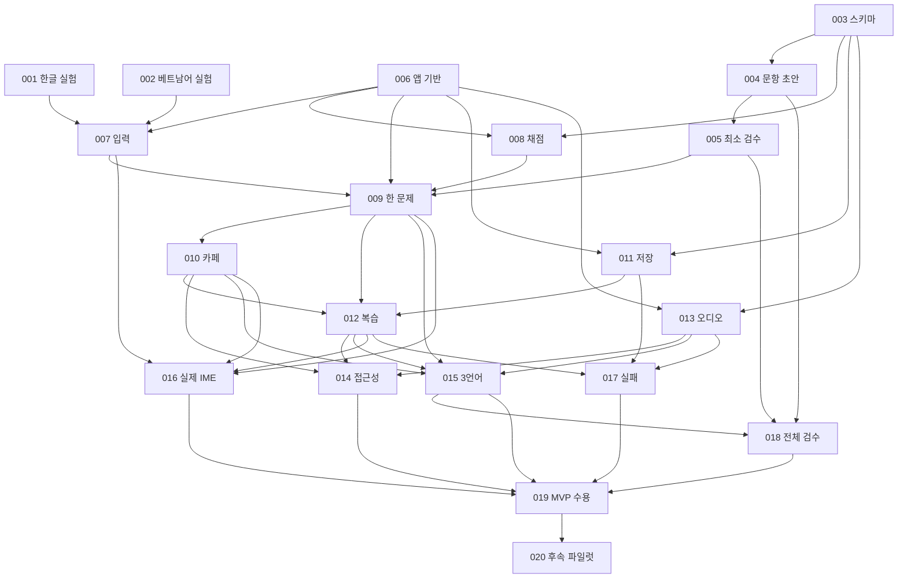

# I002 · 개발 실행 계획

상태: **상세 설계·로컬 티켓 준비 / 제품 구현 미실행** · 기준일: 2026-09-30

## 1. PlannerOutput

- what: A001/D001/T001 발전, D002~D004 상세화, MH-001~020 수용 가능한 티켓, 실제 로컬 Kanban 반영.
- why: IME·번역·채점 위험을 먼저 확인하고 한 문제 흐름에서 카페·복습으로 확장할 실행 순서가 필요하다.
- assumptions: PC의 베트남어권 성인 초급자, Windows 11 Chrome/Edge 우선, 20개 개념×3언어 짧은 변형, 선택 오디오. 모두 기술/사용자 검증 전이다.
- alternativesConsidered: 서버·계정은 로컬 시작 요구에 불필요. 단일 HTML 앱도 가능하지만 여러 화면·언어 상태 관리에는 제안된 React/TS/Vite 유지. 입력란 Enter 제출보다 명시 버튼을 MVP에 선택.
- simplerAlternative: IME는 최소 로컬 페이지에서 검증하고 제품은 정적 문항·내장 상태·단일 저장키로 시작한다. 실시간 엔진·CMS·분석 SDK를 추가하지 않는다.
- successCriteria: 요구마다 설계·티켓·검증 연결, 모든 티켓 필수 필드, 순환/누락 의존성 0, Ready의 충족되지 않은 선행 0, 문서 로컬 링크 유효, Kanban과 20개 티켓 상태 일치, 제품 src/tests/baseline 미변경.
- priority: IME 위험→콘텐츠 구조/최소 검수→한 문제→카페→저장/복습→실기·품질 수용.
- constraints: karpathy-guidelines·harness-plan, 문서 작업만 승인, 기존 변경 보존, 외부 검수/모집 미실행, 첫 commit/push와 Issue 발행은 별도 승인 범위.
- complexity: L(문서/추적 범위가 넓음), 제품 런타임 변경 없음. 문서 초안 병렬 작성과 독립 정합성 검토를 사용한다.
- committeeVerdict: 해당 없음. 이번 작업은 제품 전략·가격·계약 결정이 아닌 기존 요구의 가역적인 상세화다.
- conditions: 로컬 문서·티켓·Kanban은 T1. 저장소 생성 T3는 대화 중 사용자 명시 승인으로 실행. 후속 외부 발행은 준비 후 승인 범위 확인.
- baseCommit: 없음(unborn). 최초 브랜치 codex/initial-setup, 전체 초기 파일 미추적 상태였으며 시작 전 원본을 로컬 TEMP에 보존했다.

## 2. 현재 상태와 초기화 이력 대조

[I001](I001-initialization.md)은 2026-09-29 기록으로 보존한다. 이번 시작 때 브랜치 codex/initial-setup·커밋 0·remote 없음·src/tests는 .gitkeep만·baseline scaffold를 직접 확인했다. 기존 tickets 디렉터리는 없었다.

진행 중 사용자가 GitHub 저장소 생성을 지시했고, [jini92/MAIHANGUL](https://github.com/jini92/MAIHANGUL)을 비공개로 생성했다. master 요청에 따라 로컬 브랜치는 **master**, origin은 해당 저장소로 연결했다. 원격은 빈 저장소이며 default_branch 변경 API가 422를 반환했다. 원격 기본 브랜치의 현재 메타데이터는 main이고, 최초 master push 후 변경해야 한다. 커밋·push·Issue 발행·배포는 현재 미실행이다.

## 3. 요구사항 → 설계 → 티켓 → 검증

검증 ID/절차의 정본은 [T001](T001-validation-plan.md)이다. 표의 연결은 구현·테스트 통과를 뜻하지 않는다. R05는 역사 보존 검사이고 나머지가 제품 요구다.

| 요구사항 | 설계 정본 | 구현·수용 티켓 | 검증 ID |
|---|---|---|---|
| R01 한글 학습·입력 | [D002](D002-learning-game-ux.md), [D004](D004-content-data-rights.md) | [MH-004](tickets/MH-004.md), [MH-009](tickets/MH-009.md), [MH-010](tickets/MH-010.md), [MH-019](tickets/MH-019.md), [MH-020](tickets/MH-020.md) | V01 |
| R02 3언어 UI·문구·입력 | [D001](D001-architecture-overview.md), [D002](D002-learning-game-ux.md), [D004](D004-content-data-rights.md) | [MH-002](tickets/MH-002.md), [MH-003](tickets/MH-003.md), [MH-004](tickets/MH-004.md), [MH-005](tickets/MH-005.md), [MH-006](tickets/MH-006.md), [MH-009](tickets/MH-009.md), [MH-015](tickets/MH-015.md), [MH-018](tickets/MH-018.md), [MH-019](tickets/MH-019.md) | V02 |
| R03 하단 해석 | [D002](D002-learning-game-ux.md), [D004](D004-content-data-rights.md) | [MH-004](tickets/MH-004.md), [MH-005](tickets/MH-005.md), [MH-009](tickets/MH-009.md), [MH-012](tickets/MH-012.md), [MH-015](tickets/MH-015.md), [MH-018](tickets/MH-018.md), [MH-019](tickets/MH-019.md) | V03 |
| R04 독자 콘텐츠·권리 | [D004](D004-content-data-rights.md) | [MH-003](tickets/MH-003.md), [MH-004](tickets/MH-004.md), [MH-005](tickets/MH-005.md), [MH-010](tickets/MH-010.md), [MH-013](tickets/MH-013.md), [MH-018](tickets/MH-018.md), [MH-019](tickets/MH-019.md) | V04 |
| R05 초기화 이력 | [I001](I001-initialization.md) | [MH-019](tickets/MH-019.md) | V05 |
| R06 독립 설정 | [D002](D002-learning-game-ux.md) | [MH-006](tickets/MH-006.md), [MH-007](tickets/MH-007.md), [MH-009](tickets/MH-009.md), [MH-015](tickets/MH-015.md), [MH-019](tickets/MH-019.md) | V06 |
| R07 한글 IME | [D003](D003-input-scoring.md) | [MH-001](tickets/MH-001.md), [MH-007](tickets/MH-007.md), [MH-016](tickets/MH-016.md), [MH-019](tickets/MH-019.md) | V07 |
| R08 NFC·Telex/VNI | [D003](D003-input-scoring.md) | [MH-002](tickets/MH-002.md), [MH-007](tickets/MH-007.md), [MH-008](tickets/MH-008.md), [MH-016](tickets/MH-016.md), [MH-019](tickets/MH-019.md) | V08 |
| R09 분리 지표 | [D003](D003-input-scoring.md) | [MH-002](tickets/MH-002.md), [MH-008](tickets/MH-008.md), [MH-009](tickets/MH-009.md), [MH-010](tickets/MH-010.md), [MH-016](tickets/MH-016.md), [MH-019](tickets/MH-019.md), [MH-020](tickets/MH-020.md) | V09 |
| R10 카페 게임 | [D002](D002-learning-game-ux.md) | [MH-010](tickets/MH-010.md), [MH-019](tickets/MH-019.md) | V10 |
| R11 오류 복습 | [D001](D001-architecture-overview.md), [D002](D002-learning-game-ux.md) | [MH-012](tickets/MH-012.md), [MH-019](tickets/MH-019.md) | V11 |
| R12 로컬 저장 | [D001](D001-architecture-overview.md) | [MH-011](tickets/MH-011.md), [MH-017](tickets/MH-017.md), [MH-019](tickets/MH-019.md) | V12 |
| R13 접근성 | [D002](D002-learning-game-ux.md) | [MH-006](tickets/MH-006.md), [MH-014](tickets/MH-014.md), [MH-019](tickets/MH-019.md) | V13 |
| R14 오디오 실패 | [D001](D001-architecture-overview.md), [D004](D004-content-data-rights.md) | [MH-013](tickets/MH-013.md), [MH-017](tickets/MH-017.md), [MH-019](tickets/MH-019.md) | V14 |
| R15 최소 개인정보 | [D001](D001-architecture-overview.md) | [MH-006](tickets/MH-006.md), [MH-011](tickets/MH-011.md), [MH-017](tickets/MH-017.md), [MH-019](tickets/MH-019.md) | V15 |
| R16 20개 검수 | [D004](D004-content-data-rights.md) | [MH-003](tickets/MH-003.md), [MH-004](tickets/MH-004.md), [MH-005](tickets/MH-005.md), [MH-018](tickets/MH-018.md), [MH-019](tickets/MH-019.md) | V16 |
| R17 중단·재개 | [D001](D001-architecture-overview.md), [D002](D002-learning-game-ux.md), [D003](D003-input-scoring.md) | [MH-001](tickets/MH-001.md), [MH-007](tickets/MH-007.md), [MH-009](tickets/MH-009.md), [MH-011](tickets/MH-011.md), [MH-012](tickets/MH-012.md), [MH-014](tickets/MH-014.md), [MH-016](tickets/MH-016.md), [MH-017](tickets/MH-017.md), [MH-019](tickets/MH-019.md) | V17 |
| R18 오류 콘텐츠 | [D004](D004-content-data-rights.md) | [MH-003](tickets/MH-003.md), [MH-009](tickets/MH-009.md), [MH-015](tickets/MH-015.md), [MH-018](tickets/MH-018.md), [MH-019](tickets/MH-019.md) | V18 |
| R19 진도·단계 | [D002](D002-learning-game-ux.md) | [MH-006](tickets/MH-006.md), [MH-012](tickets/MH-012.md), [MH-019](tickets/MH-019.md), [MH-020](tickets/MH-020.md) | V19 |

## 4. 의존 관계와 실행 순서

정확한 직접 선행 목록은 [INDEX](tickets/INDEX.md)와 각 티켓 frontmatter에 있다. 아래는 같은 의존성을 한 번씩 적은 위상 단계다. 같은 줄은 모두 동시에 착수 가능하다는 뜻이 아니며 **각 티켓의 직접 선행 수용 조건**을 먼저 확인한다.

| 단계 | 작업 | 단계 완료 기준 |
|---|---|---|
| 0 위험·기반 | MH-001, MH-002, MH-003, MH-006 | 실제 IME 관찰 근거, 콘텐츠 검사 계약, 3언어 기반 확보 |
| 1 문항·엔진 | MH-004, MH-007, MH-008, MH-011, MH-013 | 20개 draft, 안정된 확정 입력/산식, 저장·음성 실패 경계 구현 |
| 2 최소 검수 | MH-005 | C005/C011/C017의 3개 개념 전 언어 변형 실제 검수 |
| 3 한 문제 | MH-009 | 검수 콘텐츠로 입력→확인→해석→분리 결과 완료 |
| 4 카페 | MH-010 | 무제한 시간 3보기 의미 선택·첫 결과 잠금 |
| 5 진도·복습 | MH-012 | 오류 분리·해석 선택·저장·이어하기 |
| 6 환경·품질 | MH-014, MH-015, MH-016, MH-017 | 접근성·9언어조합·8실기환경·실패 흐름 근거 |
| 7 전체 검수 | MH-018 | 20개 전 변형과 UI 3언어 문구의 검수/권리 근거 |
| 8 로컬 MVP 수용 | MH-019 | 모든 필수 요구의 실제 근거, 지원 환경·잔여 문제 명시 |
| 후속 탐색 | MH-020 | 승인된 소규모 평가의 관찰과 가정 수정; 기술 MVP 필수 gate는 아님 |

콘텐츠 초안으로 내부 UI 제작은 가능하지만 MH-009의 수용을 검수 전에 완료 처리하지 않는다. 실제 입력기 미확보나 검수자 부재는 해당 티켓을 Blocked로 유지하고 독립 작업을 진행한다.

## 5. 첫 개발 단계의 Ready

1. **[MH-001](tickets/MH-001.md)**: 한글 조합/제출의 실제 이벤트를 먼저 알아야 입력 구현을 잘못 고정하지 않는다.
2. **[MH-002](tickets/MH-002.md)**: Telex/VNI를 함께 실험하여 베트남어를 뒤로 미루지 않는다.
3. **[MH-003](tickets/MH-003.md)**: 검수·권리·세 언어 누락을 잡는 콘텐츠 계약은 앱 없이도 준비할 수 있다.
4. **[MH-006](tickets/MH-006.md)**: 입력 실험과 별개로 작은 앱·3언어 설정 기반을 준비한다.

실기 환경의 버전·설치 여부는 아직 확인 완료가 아니다. Ready 실험은 환경 점검/프로브 준비부터 착수할 수 있지만 실제 타이핑 근거 없이 완료할 수 없다. 현재 이 네 티켓도 미실행이다.

## 6. 로컬 Kanban 반영

실제 위치: `C:/Users/jini9/OneDrive/Documents/JINI_SYNC/01.PROJECT/34.MAIHANGUL/KANBAN.md`.

기존 구조는 kanban-plugin: basic과 Backlog/Sprint 1/In Progress/Done 네 열이었다. 기존 Done 2건과 후속 Backlog 2건은 보존하고, Sprint 1을 Ready 4건으로 구체화하며 Blocked 열을 추가한다. docs SymbolicLink가 `C:/TEST/MAIHANGUL/docs`를 가리키는 것을 확인했다. 카드 링크는 이 연결 아래 tickets 파일을 참조한다.

| 기존 Sprint 카드 | 이번 처리 |
|---|---|
| 성인 베트남 초급 학습자·PC 환경 가정과 PRD Draft 검토 | 요구/가정 상세화 문서 완료로 기록; 실제 가정 확인은 MH-020 |
| 직접 작성한 20문항의 한국어·영어·베트남어 번역 및 원어민 검수 계획 | 구성/검수 계획 문서 완료; 실제 작성 MH-004, 검수 MH-005/018 |
| 주요 화면 3장·문장 아래 해석·독자 카페 주문 게임 규칙 설계 | D002의 5개 화면·규칙으로 완료 |
| 한글 조합 완료·베트남어 성조·유니코드 정규화 입력 판정 검증 | MH-001/002/007/016으로 분해, 제품 검사 완료로 표시하지 않음 |
| Chrome·Edge 첫 과제 사용성·의미 이해·재사용 평가 기준 수립 | T001 계획 문서 완료, 실제 제품 MH-014~019와 사용자 탐색 MH-020 |

다른 프로젝트/전체 대시보드/공유 MAIBOT 큐·원장은 이번 범위에서 수정하지 않는다. 로컬 파일 반영만 확인하며 OneDrive 원격 동기화나 Obsidian 앱 렌더 결과를 검증했다고 표현하지 않는다.

## 7. 외부 의존·사용자 결정

- 교육·VI·EN 검수 담당/비용/일정: MH-005/018 수용에 필요. 검수표·초안·구조 개발은 계속 가능.
- 실기 환경/현지 조작자: MH-001/002/016의 실제 OS 증거에 필요.
- 오디오 제작·배포 권리: 선택 음성 도입 때 필요. 텍스트 MVP는 계속 가능.
- 실제 대상·난도·재사용: MH-020에서 관찰. 모집·연락·보상은 승인 전 미실행.
- 최초 master commit/push와 외부 Issue 20건: [발행 준비](tickets/PUBLISHING.md)의 정확한 범위로 승인 요청. 저장소 생성은 이미 완료.
- 상표·도메인·가격·계약은 현재 결정하지 않는다.

## 8. 후속 범위와 보류 이유

영어·베트남어 독립 과정은 콘텐츠 검수 규모가 커지므로 한국어 중심 흐름 후 검토한다. 모바일 전용 UX는 실제 IME·기기 검증 범위가 달라 후속이다. 실시간 대전·AI·교사·계정·결제는 현재의 로그인 없는 작은 흐름에 필요하지 않다. MAITUTOR/MAISTUDYMATE 연계는 후보이며 데이터 공유·API를 구현 전제에 두지 않는다.

## 9. 문서 루프 완료 확인

계획 → 문서 작성/티켓 분할 → 링크·필드·추적·의존성·Kanban 검사 → 지적 수정 → 재검사 순으로 수행한다. 실제 결과는 [I003](I003-design-validation.md)에 기록한다. 제품 측정 전 [baseline](../benchmarks/baseline.json)은 scaffold를 그대로 유지한다.
